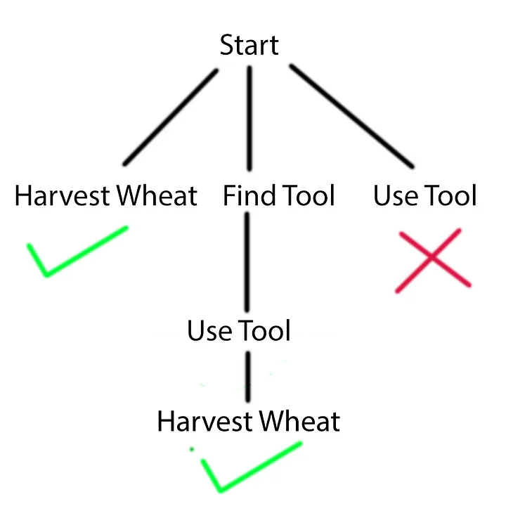
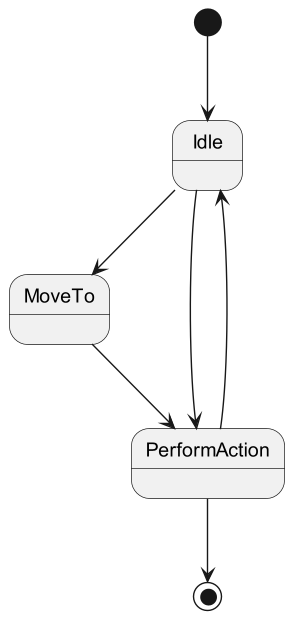

# GOAT Planning
http://alumni.media.mit.edu/~jorkin/
https://medium.com/@vedantchaudhari/goal-oriented-action-planning-34035ed40d0b
## Glossar
| Term           | Description                                                                                                                                                                                                                                                                                                                                                                                                                                                                     |
|----------------|---------------------------------------------------------------------------------------------------------------------------------------------------------------------------------------------------------------------------------------------------------------------------------------------------------------------------------------------------------------------------------------------------------------------------------------------------------------------------------|
| *State*        | Specific condition or situation that an *agent* or a system can be in at a given point in time. (kind of action?)                                                                                                                                                                                                                                                                                                                                                               |
| *Agent*        | Entity that can perceive its environment, make decisions, and take actions based on those perceptions and decisions.<br/><br/>Every Agent needs to have a list of doable actions.                                                                                                                                                                                                                                                                                               |
| *Plan*         | A *plan* is simply a sequence of *actions* that satisfy a *goal*.<br/>The *actions* take the *agent* from a starting *state* to whichever state satisfies the *goal*.                                                                                                                                                                                                                                                                                                           |
| *Goal*         | A goal is any condition that an agent wants to satisfy.                                                                                                                                                                                                                                                                                                                                                                                                                         |
| *GOAP planner* | *Goals* simply define what conditions need to be met to satisfy the *goal*, the steps required to reach these satisfactory conditions are determined in real time by the *GOAP planner*.                                                                                                                                                                                                                                                                                        |
| *Action*       | Every agent is assigned actions which are a single, atomic step within a plan that makes an agent do something.<br/>Examples of an action are playing an animation, playing a sound, altering the state, picking up flowers, etc.<br/><br/>Each defined action is aware of when it is valid to be executed and what its effects will be on the game world. Each action has both a *preconditions* and *effects* attributes which are used to chain actions into a valid *plan*. |
| *Precondition* | A precondition is the state required for an action to run.                                                                                                                                                                                                                                                                                                                                                                                                                      |
| *Effects*      | Effects are the changes to the state after an action has executed.                                                                                                                                                                                                                                                                                                                                                                                                              |
| *Cost*         | Each action has an assigned cost value, which is used by the GOAT Planner to calculate the plan and decide which plan costs less effort!                                                                                                                                                                                                                                                                                                                                        |
|                |                                                                                                                                                                                                                                                                                                                                                                                                                                                                                 |
|                |                                                                                                                                                                                                                                                                                                                                                                                                                                                                                 |
|                |                                                                                                                                                                                                                                                                                                                                                                                                                                                                                 |
|                |                                                                                                                                                                                                                                                                                                                                                                                                                                                                                 |

## The GOAP Planner
### Cost & Effort
GOAP determines which action to execute by evaluating each action’s cost.

The GOAP planner evaluates which sequence of actions to use by adding up the cumulative cost and selecting the sequence with lowest cost. 

Actions determine when to transition into and out of a state as well as what occurs in the game world due to the transition.

### Planning
An agent develops a plan in real time by supplying a goal to satisfy a planner. 

The GOAP planner looks at an *actions preconditions* and *effects* in order to determine a queue of actions to satisfy the goal. 

The target goal is supplied by the agent along with the world state and a list of valid actions; This process is referred to as “formulating a plan”.

### Plan Execution
If the planner is successful it returns a plan for the agent to follow. 

The agent executes the plan until it is completed, invalidated, or a more relevant goal is found.

If at any point the goal is completed or another goal is more relevant then the character aborts the current plan and the planner formulates a new one.

### Building an Action List
The planner finds the solution by building a tree. 

Every time an action is applied it is removed from the list of available actions.



Furthermore, you can see that the planner will run through all available actions to find the most optimal solution for the target goal. 

Remember, different actions have different costs and the planner is always looking for the solution with the cheapest cost.

On the right you can see that the planner attempts to run the Use Tool action but it validates as an unsuccessful solution, this is because of the precondition and effect attributes assigned to all actions.

### Preconditions & Effects
The Use Tool action is unable to run because it’s *precondition* is that the agent has a tool which it finds by utilizing the find tool action. 

Find Tool effects for having a toll, so it can be used to satisfy the precondition of the Use Tool action.

But, the agent can harvest wheat regardless of whether they have a tool or not, but it has a much lower cost without the tool, so the agent will prioritize finding a tool if it is available.

### World State

## How GOAP and FSM work together
In Orkin´s implementation, he used a FSM with 3 states which were:
* Idle
* MoveTo
* PerformAction



The idle state is the default state an agent starts at.

During this state, the agent passes its defined goal (which can be anything you choose, and there can be multiple different goals) to the planner along with the world and agent states.

It looks something like this:

```
HashSet<KeyValuePair<string, object>> worldState = getWorldState();
HashSet<KeyValuePair<string, object>> goal = createGoalState();

Queue<Action> plan = planner.plan(actions, worldState, goal);
```

After the agent has found a plan it checks if it is within range to execute the command or else transitions to the MoveTo state.

When within range of the target, the agent transitions to the PerformAction state in which the agent executes the action the planner specified next.